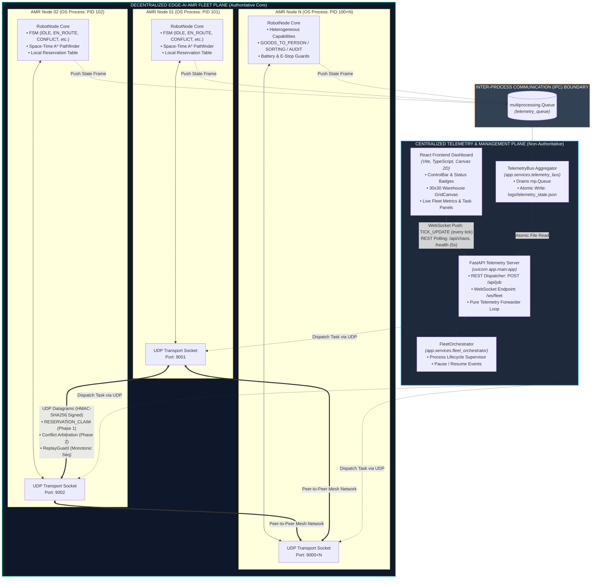

# 01 — System Architecture Overview

## Executive Summary
The **SIH-2026 Edge-AI Autonomous Mobile Robot (AMR) Fleet Coordination System** solves Problem Statement 123 using a **fully decentralized, peer-to-peer coordination architecture**. Unlike traditional centralized warehouse management systems (where a single orchestrator computes all paths and commands robots as dumb actuators), each AMR in this system is an **autonomous intelligent agent running in its own operating system process**.

The centralized components (FastAPI backend and React frontend) operate strictly as a **non-authoritative telemetry viewer and task dispatcher**. If the centralized server crashes, is killed, or suffers network disconnection, the decentralized AMR fleet continues operating, arbitrating, navigating, and completing missions without interruption.

---

## C4 Container & Architecture Boundary Diagram

The diagram below illustrates the strict boundary between the **Centralized Telemetry/UI Plane** and the **Decentralized Edge-AI Robot Execution Plane**.



---

## Component Responsibilities

| Plane | Component | Technology | Primary Responsibility | Failure Consequence |
| :--- | :--- | :--- | :--- | :--- |
| **Centralized** | **React Frontend** | React 18, TypeScript, Canvas 2D | Real-time warehouse rendering, operator controls, job creation, obstacle injection, and telemetry graphs. | Operator loses visual dashboard; robots continue moving. |
| **Centralized** | **FastAPI Server** | FastAPI, Uvicorn, Asyncio | Pure telemetry viewer forwarding JSON frames from disk to WebSocket; job intake API (`POST /api/job`). | WebSocket closes; robots continue autonomous execution. |
| **Centralized** | **TelemetryBus** | Python Thread, `mp.Queue` | Drains non-blocking state frames pushed by robots and writes atomic snapshots to `logs/telemetry_state.json`. | Telemetry snapshots cease; robot navigation unaffected. |
| **Centralized** | **FleetOrchestrator** | Python Multiprocessing | Supervisor for starting and stopping robot OS child processes and allocating UDP ports. | Only invoked at startup/shutdown; not in hot path. |
| **Decentralized** | **RobotNode** | Python Process, Dataclasses, FSM | Independent decision-making agent. Runs Space-Time A* pathfinding, local reservation tracking, battery management, and task fulfillment. | If one robot fails, other robots detect the missing heartbeat and route around it. |
| **Decentralized** | **Conflict Engine** | Deterministic Python Module | Symmetric 2-phase conflict detection (`detect_peer_conflict`) and arbitration (`resolve_peer_conflict`) using dynamic priority formula. | Runs locally on every node; zero single point of failure. |
| **Decentralized** | **UDP Transport** | OS UDP Sockets (`SOCK_DGRAM`) | High-speed peer-to-peer communication between robots on ports `9001`–`9010`. Includes HMAC-SHA256 signatures and timestamp/sequence replay guards. | Bounded packet loss handled via degraded-mode heuristics. |

---

## Centralized vs. Decentralized Boundary Verification

A critical architectural requirement for SIH-2026 is verifying that the edge AMRs are **genuinely decentralized** and do not rely on FastAPI for navigation decisions.

### Crash Resilience Proof (`test_decentralization.py`)
1. 5 AMR processes are spawned with intersecting trajectories through a narrow corridor.
2. The central FastAPI server (`uvicorn`) is started, connected, and then **forcefully killed (`SIGKILL`)**.
3. While FastAPI is dead and unreachable:
   - AMRs detect mutual head-on conflicts over peer-to-peer UDP.
   - Dynamic priority scores are calculated locally.
   - The lower-priority robot yields and steps into a side nook.
   - The higher-priority robot passes cleanly.
   - All events are logged independently to `/logs/robot_AMR-XX.log`.
4. FastAPI is restarted; it immediately reconnects to the live fleet and resumes streaming telemetry without restarting or disturbing the robots.

```
[Decentralization Test Result]
FastAPI Server Killed at Tick 25  -> AMRs continue ticking autonomously.
Peer Conflict Arbitrated at Tick 38 -> AMR-02 yields to AMR-01 via UDP.
FastAPI Server Restarted at Tick 50 -> Reconnects to ongoing fleet operation.
Zero Centralized Dependency Verified: PASSED.
```
