# 02 — Sequence: End-to-End Job Lifecycle

## Overview
This document traces the complete execution lifecycle of a user-facing warehouse job, from intake at the FastAPI REST layer through decentralized assignment, local Space-Time A* pathfinding, peer-to-peer conflict negotiation, physical execution, and mission delivery.

All sequence interactions reference **real function names** and classes directly from the codebase:
- `app.api.tasks.create_job`
- `app.services.task_manager.TaskManager.create_task`
- `app.services.task_manager.TaskManager.dispatch_to_fleet`
- `app.services.robot_node.RobotNode._drain_inbox`
- `app.services.robot_node.RobotNode._timed_find_path`
- `app.services.robot_node.RobotNode.step`
- `conflict-engine.arbitration.detect_peer_conflict`
- `conflict-engine.arbitration.resolve_peer_conflict`
- `app.services.telemetry_bus.TelemetryBus.process_incoming`

---

## Detailed Lifecycle Sequence Diagram

```mermaid
sequenceDiagram
    autonumber
    actor Operator as Operator / Dashboard
    participant API as FastAPI Router<br/>(app/api/tasks.py)
    participant TM as TaskManager<br/>(app/services/task_manager.py)
    participant Node1 as AMR-01 (Process-1)<br/>(app/services/robot_node.py)
    participant Peer as AMR-02 (Process-2)<br/>(app/services/robot_node.py)
    participant TBus as TelemetryBus<br/>(app/services/telemetry_bus.py)
    participant WS as WebSocket Clients<br/>(React Frontend)

    %% 1. Job Intake & Assignment
    rect rgb(30, 41, 59)
        note over Operator, TM: Phase 1: Centralized Job Creation & UDP Dispatch
        Operator->>API: POST /api/job {job_type: "fetch_item", urgency: 4}
        API->>API: _resolve_job_points(world, "fetch_item") -> pickup, dropoff
        API->>API: _pick_idle_robot_for_type(fleet, GOODS_TO_PERSON) -> "AMR-01"
        API->>TM: create_task(pickup, dropoff, urgency, current_tick)
        TM->>TM: try_assign(task, robots, tick)
        TM->>TM: build_task_assignment_envelope(task, "AMR-01", secret_key)
        TM->>Node1: UDP Datagram: TASK_ASSIGNMENT (Port 9001)
        API-->>Operator: HTTP 200 {task_id: "TASK-101", robot_id: "AMR-01", status: "ASSIGNED"}
    end

    %% 2. Autonomous Route Planning
    rect rgb(15, 23, 42)
        note over Node1, Node1: Phase 2: Autonomous Edge Route Planning
        Node1->>Node1: _drain_inbox(tick) -> Unpacks TASK_ASSIGNMENT
        Node1->>Node1: fsm.transition(TASK_RECEIVED) -> state = ASSIGNED
        Node1->>Node1: _timed_find_path(start, goal=pickup, reservation_table, grid)
        Node1->>Node1: reserve_path(path, robot_id="AMR-01", hold_ticks=30)
        Node1->>Node1: fsm.transition(PATH_PLANNED) -> state = EN_ROUTE_PICKUP
    end

    %% 3. Peer Intention Broadcast & Conflict Detection
    rect rgb(30, 41, 59)
        note over Node1, Peer: Phase 3: Peer-to-Peer 2-Phase Negotiation (Tick Loop)
        loop Every Simulation Tick: RobotNode.step(tick)
            Node1->>Node1: Evaluate next-hop: intended_pos = path[1]
            Node1->>Peer: UDP Broadcast: RESERVATION_CLAIM {robot_id: "AMR-01", intended_pos: (10,6), priority_score: 95.0}
            Peer->>Node1: UDP Broadcast: RESERVATION_CLAIM {robot_id: "AMR-02", intended_pos: (10,6), priority_score: 65.0}
            
            Node1->>Node1: _drain_inbox(tick) -> Updates peers["AMR-02"]
            Node1->>Node1: detect_peer_conflict(AMR-01, snap_AMR-02) -> Conflict Found (CELL_OVERLAP)
            
            Node1->>Node1: resolve_peer_conflict(AMR-01, snap_AMR-02)<br/>Compare: score(AMR-01)=95.0 vs score(AMR-02)=65.0
            note over Node1, Peer: Symmetrical Decision: AMR-01 Wins (Move) | AMR-02 Loses (Yield/Detour)
            
            Node1->>Node1: Action = "MOVED" -> position = (10, 6)
            Peer->>Peer: Action = "YIELDED / BRAKED" -> holds or evades into free nook
        end
    end

    %% 4. Waypoint Fulfillment & Delivery
    rect rgb(15, 23, 42)
        note over Node1, Node1: Phase 4: Waypoint Arrival & Mission Fulfillment
        Node1->>Node1: Arrive at pickup cell (position == task.pickup)
        Node1->>Node1: fsm.transition(PICKUP_REACHED) -> state = PICKING
        Node1->>Node1: _timed_find_path(pickup, goal=dropoff) -> Plan delivery leg
        Node1->>Node1: fsm.transition(PICKUP_COMPLETE) -> state = EN_ROUTE_DROPOFF
        Node1->>Node1: Navigate path to dropoff dock...
        Node1->>Node1: Arrive at dropoff cell (position == task.dropoff)
        Node1->>Node1: fsm.transition(DROPOFF_REACHED) -> state = DROPPING
        Node1->>Node1: fsm.transition(MISSION_COMPLETE) -> state = IDLE
        Node1->>Node1: task = None, completed_task_ids.add("TASK-101")
    end

    %% 5. Real-Time Telemetry Streaming
    rect rgb(30, 41, 59)
        note over Node1, WS: Phase 5: Telemetry Snapshot & WebSocket Broadcast
        Node1->>TBus: telemetry_queue.put_nowait(_build_telemetry_frame(tick))
        TBus->>TBus: process_incoming() -> Atomically write logs/telemetry_state.json
        API->>TBus: read_latest_telemetry()
        API->>WS: connection_manager.broadcast_json(TICK_UPDATE payload)
        WS->>Operator: Real-time map update & task completion notification
    end
```

---

## Key Lifecycle States & Deterministic Invariants

### 1. Finite State Machine Transitions (`app.models.robot_fsm.py`)
Each robot node enforces strict deterministic transitions. Invalid transitions raise `ValueError` and trigger failsafe recovery:
- `IDLE` $\xrightarrow{\text{TASK\_RECEIVED}}$ `ASSIGNED`
- `ASSIGNED` $\xrightarrow{\text{PATH\_PLANNED}}$ `EN_ROUTE_PICKUP`
- `EN_ROUTE_PICKUP` $\xrightarrow{\text{PICKUP\_REACHED}}$ `PICKING`
- `PICKING` $\xrightarrow{\text{PICKUP\_COMPLETE}}$ `EN_ROUTE_DROPOFF`
- `EN_ROUTE_DROPOFF` $\xrightarrow{\text{DROPOFF\_REACHED}}$ `DROPPING`
- `DROPPING` $\xrightarrow{\text{MISSION\_COMPLETE}}$ `IDLE`
- Any state $\xrightarrow{\text{CONFLICT\_LOST}}$ `CONFLICT_NEGOTIATING` $\xrightarrow{\text{RESUME}}$ Previous Activity

### 2. Multi-Class AMR Heterogeneity
Task assignment automatically filters eligible robots based on hardware configuration:
- **`GOODS_TO_PERSON`** (AMR-01 .. AMR-04): Handles `fetch_item` jobs between warehouse racks and export bays.
- **`SORTING`** (AMR-05 .. AMR-07): Handles `sort_batch` jobs from import dock to regional sorting bins.
- **`SCANNING_AUDIT`** (AMR-08 .. AMR-10): Executes `audit_checkpoint` jobs, patrolling shelf inventory and maintaining dock scanning logs.
