# 03 — Sequence: Conflict Resolution & The Swap-Collision Fix

## Overview
This document illustrates the head-on collision scenario documented in [`PEER_BUG_ANALYSIS.md`](file:///c:/Users/akhil/Desktop/SIHHH/SIH-2026/PEER_BUG_ANALYSIS.md) and [`FIXES_APPLIED.md`](file:///c:/Users/akhil/Desktop/SIHHH/SIH-2026/FIXES_APPLIED.md). 

In a narrow 1-tile wide corridor:
- **AMR-01** is at coordinate `(9, 6)` heading East towards `(10, 6)`.
- **AMR-02** is at coordinate `(10, 6)` heading West towards `(9, 6)`.

We contrast the **"Before (The 1-Phase Bug)"** with the **"After (The 2-Phase Intend-Then-Commit Fix)"** to visually demonstrate why the fixed protocol is mathematically guaranteed to prevent cell and swap collisions.

---

## 1. Before: The 1-Phase Movement Bug (Physical Swap Collision)

In the initial naive implementation, each robot evaluated only the *current* positions of other robots before committing movement. Because AMR-02 had not yet moved into `(9, 6)` and AMR-01 had not yet moved into `(10, 6)`, both robots evaluated their next steps as "free" and stepped simultaneously.

```mermaid
sequenceDiagram
    autonumber
    participant R1 as AMR-01<br/>Pos: (9, 6) | Goal: (18, 6)
    participant Corridor as Narrow 1-Tile Corridor<br/>Cells: (9, 6) <===> (10, 6)
    participant R2 as AMR-02<br/>Pos: (10, 6) | Goal: (1, 6)

    note over R1, R2: Tick 15: Both robots approach in opposite directions

    rect rgb(69, 10, 10)
        note over R1, R2: ⚠️ BUG: 1-Phase Immediate Movement (No Intention Exchange)
        R1->>R1: Check position of AMR-02 -> Currently at (10, 6)
        R1->>R1: "Cell (10, 6) is occupied, BUT my path says move there next tick"
        R2->>R2: Check position of AMR-01 -> Currently at (9, 6)
        R2->>R2: "Cell (9, 6) is occupied, BUT my path says move there next tick"
        
        note over R1, R2: Both robots update coordinates simultaneously without prior intent agreement
        R1->>Corridor: Moves East: (9, 6) ──> (10, 6)
        R2->>Corridor: Moves West: (10, 6) ──> (9, 6)
        
        note over Corridor: 💥 SWAP COLLISION OCCURRED at Tick 16!<br/>AMR-01 and AMR-02 crossed trajectories in opposite directions.<br/>Physical robots would crash head-on or scissor.
    end
```

### Why the Bug Occurred
1. **Single-Phase Commit:** A robot checked obstacles, chose a cell, and updated `self.robot.position` in the same step before publishing its new position to peers.
2. **Asynchronous Blindness:** Peer updates sent over UDP reported where the robot *was*, not where it *intended to be in the immediate next tick*.
3. **No Symmetric Mutual Exclusion:** Neither robot knew the other was planning to occupy its own current tile on the exact same tick.

---

## 2. After: The Fixed 2-Phase Intend-Then-Commit Protocol

The solution implemented in `app/services/robot_node.py` and `conflict-engine/arbitration.py` splits movement into **two explicit, non-overlapping phases** per simulation tick:
- **Phase 1 (Intention Claim):** Calculate candidate next-hop `intended_pos` and broadcast a signed `RESERVATION_CLAIM` UDP packet to all peers. **No robot updates its position yet.**
- **Phase 2 (Arbitration & Movement):** Drain all peer claims. Detect mutual conflicts. Run the deterministic priority arbitration formula. Winner moves; loser yields or steps into an evasion nook.

```mermaid
sequenceDiagram
    autonumber
    participant R1 as AMR-01<br/>Pos: (9, 6) | Urgency: 5 (Score: 100)
    participant Net as P2P UDP Mesh<br/>(Ports 9001-9002)
    participant R2 as AMR-02<br/>Pos: (10, 6) | Urgency: 3 (Score: 60)

    note over R1, R2: Tick 15 — PHASE 1: Intention Broadcast (Neither robot moves!)
    
    rect rgb(30, 41, 59)
        R1->>R1: Next path step: intended_pos = (10, 6)
        R1->>Net: Broadcast UDP RESERVATION_CLAIM<br/>{pos: (9,6), intended: (10,6), priority: 100.0}
        
        R2->>R2: Next path step: intended_pos = (9, 6)
        R2->>Net: Broadcast UDP RESERVATION_CLAIM<br/>{pos: (10,6), intended: (9,6), priority: 60.0}
    end

    note over R1, R2: Tick 15 — PHASE 2: Inbox Drain & Symmetric Arbitration
    
    rect rgb(15, 23, 42)
        Net->>R1: Deliver AMR-02 claim: intended=(9, 6), pos=(10, 6)
        Net->>R2: Deliver AMR-01 claim: intended=(10, 6), pos=(9, 6)
        
        note over R1: R1 Conflict Check:<br/>intended_R1 (10,6) == pos_R2 (10,6) AND<br/>intended_R2 (9,6) == pos_R1 (9,6)<br/>==> SWAP_CONFLICT DETECTED!
        note over R2: R2 Conflict Check:<br/>intended_R2 (9,6) == pos_R1 (9,6) AND<br/>intended_R1 (10,6) == pos_R2 (10,6)<br/>==> SWAP_CONFLICT DETECTED!
        
        note over R1, R2: Arbitration Formula: Priority = (Urgency × 20) + (Waits × 10) + BatteryBonus + Tiebreaker
        R1->>R1: My Score (100.0) > Peer Score (60.0) ==> I AM THE WINNER!
        R2->>R2: My Score (60.0) < Peer Score (100.0) ==> I AM THE LOSER (YIELD)!
    end

    note over R1, R2: Tick 15 — Movement Execution
    
    rect rgb(6, 78, 59)
        R1->>R1: Winner commits movement: position = (10, 6). Action = "MOVED"
        R2->>R2: Loser yields right-of-way: position stays (10, 6). Action = "YIELDED / BRAKED"<br/>Increments wait_ticks_so_far += 1 (Score increases by +10 next tick!)
        R2->>R2: Evaluate candidate side nooks [(10,5), (10,7)] to clear corridor
    end

    note over R1, R2: Tick 16: Resolution Confirmed
    R1->>R1: AMR-01 safely passes through cell (10, 6).
    R2->>R2: Once AMR-01 has passed, AMR-02 replans and resumes journey to (1, 6).
    note over R1, R2: ✅ Result: 100% Collision-Free. Zero Swap Collisions. Zero Deadlocks.
```

---

## 3. Mathematical Conflict Classification

The conflict detection engine evaluates three distinct geometric classes of interaction between `RobotNode` ($R$) and any peer snapshot ($P$):

| Conflict Type | Formal Geometric Condition | Physical Meaning | Resolution Strategy |
| :--- | :--- | :--- | :--- |
| **`SWAP_CONFLICT`** | $intended_R = pos_P \land intended_P = pos_R \land pos_R \ne pos_P$ | Two robots attempting to swap adjacent cells head-on. | Loser halts or steps into adjacent side nook; Winner moves forward. |
| **`CELL_OVERLAP`** | $intended_R = intended_P \land intended_R \ne pos_R$ | Two robots attempting to enter the exact same destination cell at tick $t+1$. | Higher priority claims the cell; Loser waits in current cell. |
| **`STATIONARY_BLOCK`** | $intended_R = pos_P \land intended_P = pos_P$ | A moving robot's path is blocked by a parked/idle or charging robot. | Oncoming robot invokes A* with peer's position reserved for `HOLD=100` ticks. |

---

## 4. Priority Formula & Starvation Prevention

The priority score $S_i$ of robot $i$ is calculated deterministically by both peers:

$$S_i = (U_i \times 20.0) + (W_i \times 10.0) + B_i + T_i$$

Where:
- **$U_i \in [1, 5]$ (Mission Urgency):** High-urgency goods-to-person orders receive higher base priority.
- **$W_i \ge 0$ (Consecutive Wait Ticks):** Every tick a robot yields or halts, its priority increases by **$+10.0$ points**. This mathematically guarantees that no robot can ever be starved indefinitely—even a low-urgency robot will eventually outscore a high-urgency robot after yielding for a few ticks.
- **$B_i$ (Low Battery Bonus):** Robots with battery $< 25\%$ traveling to a charger receive $+50.0$ points to prevent emergency battery exhaustion.
- **$T_i$ (Lexicographic Tiebreaker):** If scores are mathematically identical, $ID_1 < ID_2$ breaks ties deterministically across all nodes without a central arbiter.
