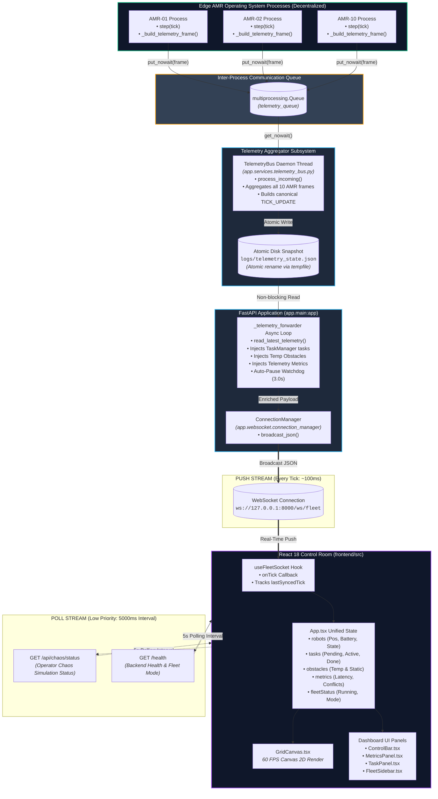

# 04 — Telemetry Data Flow & Synchronization

## Overview
This document specifies how simulation telemetry originates inside individual edge AMR operating system processes and flows through the decentralized telemetry pipeline to the browser-based React control room.

It details the **Push-vs-Poll architectural split** established in Phase 2, which eliminated UI stutter and tick desynchronization by synchronizing robot positions, active tasks, temporary obstacles, and fleet metrics onto a single unified WebSocket payload.

---

## End-to-End Data Pipeline Diagram



---

## The Push-vs-Poll Architectural Split

### Why Independent REST Polling Was Removed (Phase 2 Finding)
In the initial codebase, robot positions arrived via WebSocket on every tick (~100ms), while tasks, metrics, and fleet status were polled over separate REST endpoints (`api.tasks()`, `api.metrics()`, `api.status()`) on an unaligned 1500ms `setInterval`. This led to:
1. **Visual Desynchronization:** An AMR would appear visually at a dropoff dock while the task panel still showed the task as `IN_PROGRESS` or `PENDING` because the REST poll had not yet fired.
2. **Network Overhead:** Redundant HTTP handshake overhead every 1.5s while a persistent WebSocket was already open.

### The Unified WebSocket Push Contract
The `_telemetry_forwarder` in `backend/backend/app/main.py` enriches every `TICK_UPDATE` payload before broadcasting:

```json
{
  "type": "TICK_UPDATE",
  "tick": 142,
  "timestamp_ms": 1725725400120,
  "robots": [
    {
      "id": "AMR-01",
      "robot_type": "GOODS_TO_PERSON",
      "position": {"x": 10, "y": 6},
      "heading": "EAST",
      "state": "EN_ROUTE_DROPOFF",
      "battery": 94.2,
      "priority_score": 95.0,
      "wait_ticks_so_far": 0,
      "action": "MOVED",
      "current_task_id": "TASK-101",
      "planner_latency_ms": 0.354,
      "path": [{"x": 11, "y": 6}, {"x": 12, "y": 6}]
    }
  ],
  "tasks": [
    {
      "task_id": "TASK-101",
      "pickup": {"x": 5, "y": 12},
      "dropoff": {"x": 27, "y": 14},
      "urgency": 4,
      "status": "IN_PROGRESS",
      "assigned_robot_id": "AMR-01",
      "created_tick": 45
    }
  ],
  "temporary_obstacles": [],
  "metrics": {
    "tick_ms_configured": 100,
    "last_tick_processing_ms": 1.25,
    "planner_latency_ms": 0.42,
    "connected_clients": 1,
    "active_robots": 10,
    "active_conflicts": 0,
    "replans": 3
  },
  "fleet_status": {
    "running": true,
    "mode": "spawned_new_fleet",
    "tick": 142
  }
}
```

### Remaining REST Endpoints
Only two REST endpoints are polled at a relaxed **5000ms cadence**:
1. **`GET /api/chaos/status`**: Checks packet-loss simulation status configured by human operator.
2. **`GET /health`**: Confirms server process vitality and displays `fleet_mode` (`spawned_new_fleet` vs. `attached_to_existing_fleet`).

---

## Degraded Mode: Automatic Simulation Pause on Disconnect

To prevent AMR processes from consuming CPU cycles and executing missions when no operators are actively monitoring the warehouse, the `_telemetry_forwarder` implements an **Auto-Pause Watchdog**:

1. **Client Count Monitored:** `clients = len(connection_manager._connections)`
2. **Auto-Pause Trigger:** If `clients == 0` for more than **3.0 consecutive seconds**:
   - Calls `orchestrator.pause()`, which sets `self.pause_event`.
   - Each robot process sleeps in `run_robot_process`:
     ```python
     if pause_event is not None and pause_event.is_set():
         time.sleep(0.2)
         continue
     ```
   - Clock advancement freezes; battery consumption ceases; logs freeze.
3. **Auto-Resume Trigger:** As soon as a browser tab opens and connects (`clients > 0`):
   - Watchdog detects client and calls `orchestrator.resume()`.
   - `self.pause_event` is cleared.
   - All 10 AMR processes immediately resume ticking from the exact tick where they paused.
   - The frontend receives a clean sequence without giant skipped-tick jumps.
